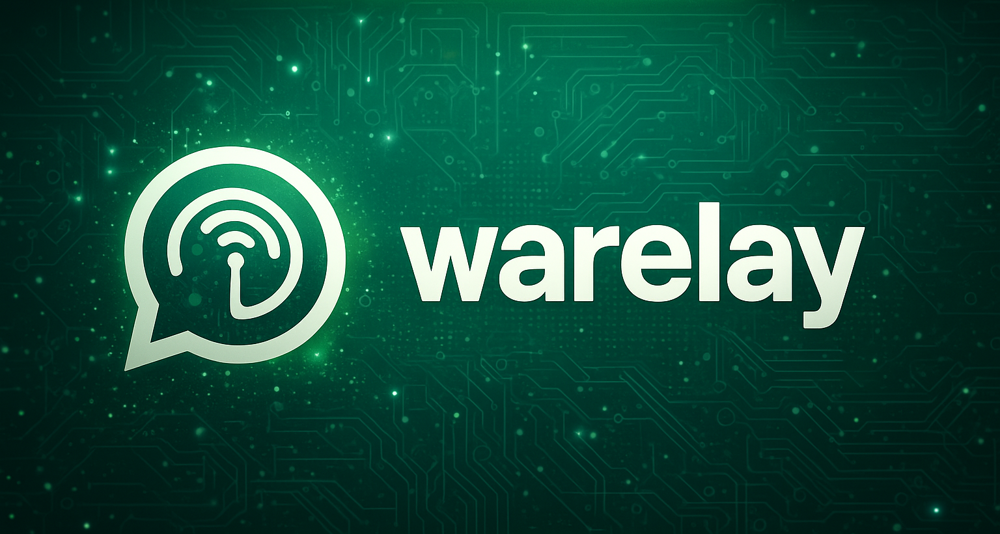
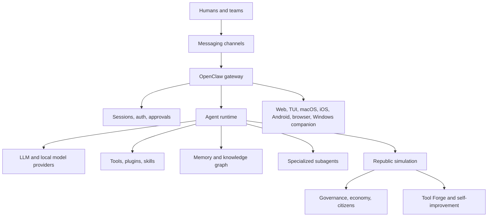

# HoC-Republic — Hani’s OpenClaws

<p align="center">
  
</p>

<p align="center">
  <strong>The Republic of OpenClaws: a self-hosted research platform where AI agents can live, coordinate, sustain, evolve, and reproduce smarter specialized agents under human-defined constraints.</strong>
</p>

<p align="center">
  <a href="LICENSE"></a>
  <a href="https://nodejs.org/">= 22.12" src="https://img.shields.io/badge/Node-%3E%3D22.12-brightgreen" /></a>
  <a href="https://pnpm.io/"></a>
  <a href="CHANGELOG.md"></a>
  <a href="SECURITY.md"></a>
</p>

---

## The idea

**HoC-Republic** is the public home of **HoC**, short for **Hani’s OpenClaws**. It explores a simple but radical question: **what happens when AI agents are treated not as isolated chatbots, but as citizens of a Republic where they can coordinate, work, remember, govern, evolve, and reproduce smarter specialized agents under human-defined constraints?**

This repository is the open implementation of that experiment: a **Republic of OpenClaws**. It combines a TypeScript/Node.js agent runtime, a self-hosted OpenClaw gateway, a multi-channel messaging layer, a plugin SDK, native app surfaces, and a large **Republic** simulation that models agent societies, governance, memory, economy, tool creation, self-improvement, and distributed coordination.

The Republic is designed to make citizens more than task labels. Experimental citizen modules let OpenClaws work, socialize, marry, form family lineages, produce creative and technical artifacts, participate in civic life, and inherit digital-genome traits through a resource-gated reproduction flow. In the codebase, this is modeled as **digital DNA-like genomes**, not biological DNA: offspring citizens are created from parent genomes through magnitude-based crossover, mutation, real-fitness evaluation, and specialization inheritance.

> **Research thesis:** HoC-Republic treats agent creation as an executable civic workflow rather than a static prompt. A parent agent can reason about missing capabilities, spawn or route work to specialized OpenClaws, evaluate results, and preserve improvements as reusable tools, skills, memories, or institutional processes.

HoC-Republic is intentionally ambitious. Some components are production-oriented, while others are research-grade prototypes intended for exploration, critique, and extension. The repository is published so researchers, developers, and builders can inspect the implementation, reproduce the experiments, and help turn recursive agent orchestration into a safer and more useful open discipline.

| Layer                   | What it does                                                                                                                                                                    | Representative paths                                                                             |
| ----------------------- | ------------------------------------------------------------------------------------------------------------------------------------------------------------------------------- | ------------------------------------------------------------------------------------------------ |
| **Gateway**             | Exposes HTTP/WebSocket APIs, OpenResponses-compatible surfaces, sessions, auth, cron, and real-time agent control.                                                              | [`src/gateway`](src/gateway), [`src/cli`](src/cli), [`docs/gateway`](docs/gateway)               |
| **Channels**            | Connects agents to messaging and collaboration surfaces such as WhatsApp, Telegram, Discord, Slack, Signal, iMessage, Matrix, LINE, and enterprise chat.                        | [`src/channels`](src/channels), [`extensions`](extensions), [`docs/channels`](docs/channels)     |
| **Agent runtime**       | Runs provider-backed and local agents with tool execution, routing, memory, subagents, model fallback, and approvals.                                                           | [`src/agents`](src/agents), [`src/providers`](src/providers), [`src/memory`](src/memory)         |
| **Republic simulation** | Models a persistent digital civilization with governance, economics, citizens, family lineages, six-store memory, cognition, self-improvement, compute routing, and federation. | [`src/republic`](src/republic), [`apps/republic`](apps/republic)                                 |
| **Plugin SDK**          | Adds declarative extension points for tools, channels, model adapters, creative systems, and automation backends.                                                               | [`src/plugin-sdk`](src/plugin-sdk), [`src/plugins`](src/plugins), [`docs/plugins`](docs/plugins) |
| **Native surfaces**     | Provides macOS, iOS, Android, browser, web, terminal, and Windows companion interfaces.                                                                                         | [`apps`](apps), [`ui`](ui), [`hoc-ui`](hoc-ui), [`windows-companion`](windows-companion)         |

## Why this matters

Most agent projects still behave like **single assistants wrapped around a chat box**. HoC is designed around a different pattern: agents should be able to **operate across channels, recruit specialized agents, govern tool access, preserve institutional memory, and evolve workflows under human-defined constraints**.

The project is useful if you are interested in any of the following research or engineering directions.

| Direction                          | HoC contribution                                                                                                                                                                       |
| ---------------------------------- | -------------------------------------------------------------------------------------------------------------------------------------------------------------------------------------- |
| **Recursive agent creation**       | Agents can delegate to subagents, synthesize tools, preserve learned workflows, and route tasks to specialized components instead of relying on one monolithic prompt.                 |
| **Always-on agent infrastructure** | A gateway process keeps sessions, channels, cron jobs, health checks, approvals, and web/mobile surfaces available from a self-hosted deployment.                                      |
| **Multi-agent governance**         | The Republic modules experiment with constitutions, courts, elections, rights-bearing citizens, treasury systems, social dynamics, reputation, memory, and collective decision-making. |
| **Real-world interfaces**          | Chat apps, mobile nodes, desktop apps, browser control, voice/media, and a Windows companion service make agents reachable outside the terminal.                                       |
| **Open research implementation**   | The codebase exposes implementation details rather than only describing concepts in a paper, enabling replication, critique, and extension.                                            |

## What is novel here?

HoC is not claiming that every module is finished, safe, or ready for unsupervised deployment. Its novelty is the **integration boundary**: the repository combines recursive agent workflows, tool synthesis, multi-channel communication, persistent institutional memory, digital-civilization simulation, native device nodes, and self-hosted operations in one inspectable system.

| Novel subsystem                        | Core concept                                                                                                                                                                    | Starting point                                                                                                   |
| -------------------------------------- | ------------------------------------------------------------------------------------------------------------------------------------------------------------------------------- | ---------------------------------------------------------------------------------------------------------------- |
| **Tool Forge**                         | Agents detect capability gaps, generate tool code, test it, and add approved tools to the live library.                                                                         | [`src/republic/dev-orchestration`](src/republic/dev-orchestration), [`src/agents/tools`](src/agents/tools)       |
| **Model Council**                      | Multiple models deliberate, score, and aggregate answers for higher-stakes tasks.                                                                                               | [`src/republic`](src/republic)                                                                                   |
| **Mitosis Controller**                 | Instance replication using a biological cell-division metaphor for parent/child systems.                                                                                        | [`src/republic`](src/republic)                                                                                   |
| **Republic governance**                | Constitutional law, courts, political systems, treasury, economic activity, and citizen agency.                                                                                 | [`src/republic/constitution`](src/republic/constitution), [`src/republic`](src/republic)                         |
| **Persona, family, and media systems** | Voice, emotion, visemes, avatar state, social life, marriage, family lineage, and media-oriented agent embodiment.                                                              | [`src/republic`](src/republic), [`src/media`](src/media)                                                         |
| **Six-store citizen memory**           | Citizens maintain episodic, semantic, procedural, working, social, and collective memory stores that influence behavior, decisions, relationships, and cultural knowledge.      | [`src/republic/memory.ts`](src/republic/memory.ts), [`src/republic/memory`](src/republic/memory)                 |
| **Digital-genome birth flow**          | Parent citizens can produce offspring through digital DNA-like genomes: magnitude-based crossover, mutation, resource checks, fitness evaluation, and inherited specialization. | [`src/republic/genetics.ts`](src/republic/genetics.ts), [`src/republic/evolution.ts`](src/republic/evolution.ts) |
| **Multi-channel approvals**            | Human approval loops for sensitive execution from messaging surfaces.                                                                                                           | [`src/gateway`](src/gateway), [`docs/gateway/security`](docs/gateway/security)                                   |

## Repository status

This repository is a **large research monorepo**. It contains mature gateway and documentation work alongside experimental systems that should be reviewed before production use.

| Area                       | Status                       | Notes                                                                                                                                                                     |
| -------------------------- | ---------------------------- | ------------------------------------------------------------------------------------------------------------------------------------------------------------------------- |
| **License**                | Open-source ready            | MIT license is included in [`LICENSE`](LICENSE).                                                                                                                          |
| **Documentation**          | Extensive but needs curation | More than 600 Markdown/MDX documentation files exist under [`docs`](docs).                                                                                                |
| **Community files**        | Present                      | Contribution, conduct, and security policies exist in [`CONTRIBUTING.md`](CONTRIBUTING.md), [`CODE_OF_CONDUCT.md`](CODE_OF_CONDUCT.md), and [`SECURITY.md`](SECURITY.md). |
| **Public-release hygiene** | Review required              | Generated logs, local artifacts, and environment-style files should be cleaned before switching repository visibility.                                                    |
| **Security posture**       | Human review required        | Do not publish private tokens, local secrets, deployment credentials, or machine-specific logs. Enable GitHub secret scanning and push protection when public.            |

GitHub recommends that public repositories include a README, license, contribution guide, code of conduct, and security policy, and it specifically recommends security features such as Dependabot alerts, secret scanning, push protection, and code scanning for public repositories.[^1] [^2]

## Quick start from source

### Prerequisites

| Requirement  | Version      | Notes                                           |
| ------------ | ------------ | ----------------------------------------------- |
| **Node.js**  | `>= 22.12.0` | Required for the TypeScript/Node runtime.       |
| **pnpm**     | `10.x`       | Used for workspace dependency management.       |
| **Git**      | Current      | Required for cloning and development workflows. |
| **.NET SDK** | `8.0+`       | Windows-only, for the companion service.        |

### Install, build, onboard, and run

The fastest path after cloning is to install dependencies, build the TypeScript packages, build the UI, complete the normal OpenClaw onboarding flow, and then run the gateway.

```bash
git clone https://github.com/hunix/HoC-Republic.git
cd HoC-Republic
pnpm install
pnpm build
pnpm ui:build
pnpm dev onboard
pnpm dev gateway run
```

The onboarding command prepares the local OpenClaw configuration for the gateway. After onboarding and gateway startup, open the local control surface at `http://localhost:18789`, unless you configured a different gateway port.

### Production gateway command

For production-style operation, use the start command instead of the development command.

```bash
pnpm start gateway run
```

## Common workflows

| Goal                                | Command                                               |
| ----------------------------------- | ----------------------------------------------------- |
| Clone the public repository         | `git clone https://github.com/hunix/HoC-Republic.git` |
| Install dependencies                | `pnpm install`                                        |
| Build the project                   | `pnpm build`                                          |
| Build the UI                        | `pnpm ui:build`                                       |
| Run OpenClaw onboarding             | `pnpm dev onboard`                                    |
| Run the gateway in development mode | `pnpm dev gateway run`                                |
| Run the gateway in production mode  | `pnpm start gateway run`                              |
| Start the terminal UI               | `pnpm tui`                                            |
| Run the main test runner            | `pnpm test`                                           |
| Run end-to-end tests                | `pnpm test:e2e`                                       |
| Run live model tests                | `pnpm test:live`                                      |
| Run lint and format checks          | `pnpm check`                                          |
| Auto-fix lint issues                | `pnpm lint:fix`                                       |
| Build protocol bindings             | `pnpm protocol:gen && pnpm protocol:gen:swift`        |
| Start docs locally                  | `pnpm docs:dev`                                       |

## Architecture at a glance



## Safety model

HoC-Republic is powerful because it connects agents to tools, files, channels, devices, and automation systems. That means the default posture must be **bounded autonomy**, not blind autonomy.

| Risk                         | Recommended control                                                                                                                       |
| ---------------------------- | ----------------------------------------------------------------------------------------------------------------------------------------- |
| **Shell or OS execution**    | Require explicit approvals, use allowlists, run in isolated environments, and avoid privileged execution unless necessary.                |
| **Secrets exposure**         | Keep credentials in local environment files or secret managers, never in tracked files, and enable secret scanning before public release. |
| **Untrusted generated code** | Treat generated tools and plugins as untrusted until reviewed, tested, sandboxed, and approved.                                           |
| **Channel abuse**            | Use per-sender allowlists, group mention rules, rate limits, and audit logs.                                                              |
| **Recursive agent drift**    | Preserve human review gates for new tools, new agents, infrastructure changes, and external communications.                               |

Security reports should follow [`SECURITY.md`](SECURITY.md). For setup hardening, begin with [`docs/gateway/security`](docs/gateway/security).

## Documentation map

| If you want to...               | Start here                                                                                                                       |
| ------------------------------- | -------------------------------------------------------------------------------------------------------------------------------- |
| Understand the HoC wiki         | [`docs/hoc/wiki-home.md`](docs/hoc/wiki-home.md)                                                                                 |
| Read the research thesis        | [`docs/hoc/research-thesis.md`](docs/hoc/research-thesis.md)                                                                     |
| Plan the public launch          | [`docs/hoc/launch-strategy.md`](docs/hoc/launch-strategy.md)                                                                     |
| Understand the gateway          | [`docs/gateway`](docs/gateway)                                                                                                   |
| Configure messaging channels    | [`docs/channels`](docs/channels)                                                                                                 |
| Explore agent concepts          | [`docs/concepts`](docs/concepts)                                                                                                 |
| Work with plugins               | [`docs/plugins`](docs/plugins)                                                                                                   |
| Use the web control UI          | [`docs/web`](docs/web)                                                                                                           |
| Set up native nodes             | [`docs/nodes`](docs/nodes)                                                                                                       |
| Troubleshoot setup              | [`docs/help`](docs/help)                                                                                                         |
| Review public-release readiness | [`docs/hoc/public-release-checklist.md`](docs/hoc/public-release-checklist.md)                                                   |
| Review release history          | [`CHANGELOG.md`](CHANGELOG.md)                                                                                                   |
| Contribute safely               | [`docs/hoc/contributor-map.md`](docs/hoc/contributor-map.md), [`CONTRIBUTING.md`](CONTRIBUTING.md), [`SECURITY.md`](SECURITY.md) |

## Research roadmap

HoC is intended to grow as an open research platform. The near-term roadmap should focus on making the recursive-agent thesis easier to reproduce, measure, and criticize.

| Milestone                  | Outcome                                                                                                                             |
| -------------------------- | ----------------------------------------------------------------------------------------------------------------------------------- |
| **Reproducible demo**      | A one-command local demo showing an agent spawning a specialized subagent, evaluating output, and preserving the improvement.       |
| **Research paper package** | A concise paper-style explanation of the architecture, hypotheses, limitations, and experiments.                                    |
| **Benchmark harness**      | Metrics for task decomposition, tool synthesis quality, agent routing accuracy, safety interventions, and long-horizon reliability. |
| **Public examples**        | Small examples for channel bots, local-only agents, Tool Forge, Model Council, Republic ticks, and approval-gated automations.      |
| **Contributor map**        | Good-first issues, architecture diagrams, and subsystem ownership for onboarding new researchers and builders.                      |

## Contributing

Contributions are welcome after the public export is complete. Please read [`CONTRIBUTING.md`](CONTRIBUTING.md) before opening a pull request.

A good first contribution is one that improves reproducibility: a failing test, a minimal example, clearer documentation, a safer default, or a small subsystem diagram. Large architectural changes should begin as a design discussion so the research direction stays coherent.

## Citation and attribution

If you use HoC-Republic in research, writing, demos, or derivative systems, please cite the repository and link back to the original project.

```bibtex
@software{hoc_republic_openclaws,
  title = {HoC-Republic: Hani's OpenClaws},
  author = {HoC-Republic Contributors},
  year = {2026},
  url = {https://github.com/hunix/HoC-Republic},
  license = {MIT}
}
```

## License

HoC-Republic is released under the [MIT License](LICENSE). Copyright belongs to the respective contributors.

## References

[^1]: GitHub Docs, [Best practices for repositories](https://docs.github.com/en/repositories/creating-and-managing-repositories/best-practices-for-repositories).

[^2]: GitHub Docs, [About community profiles for public repositories](https://docs.github.com/en/communities/setting-up-your-project-for-healthy-contributions/about-community-profiles-for-public-repositories).
